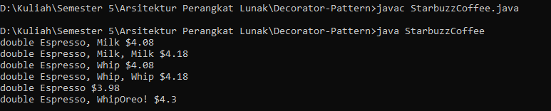
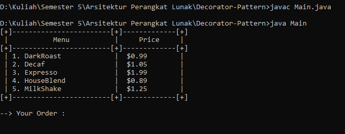

# Decorator Pattern

## Tugas : testing double espresso dan kombinasi 3 komponen
- compile kelas utama `javac StarbuzzCoffee.java`
- run program `java StarbuzzCoffee`
### Output

## Bonus : testing semua kelas
- compile kelas utama `javac Main.java`
- run program `java Main`

### Output

